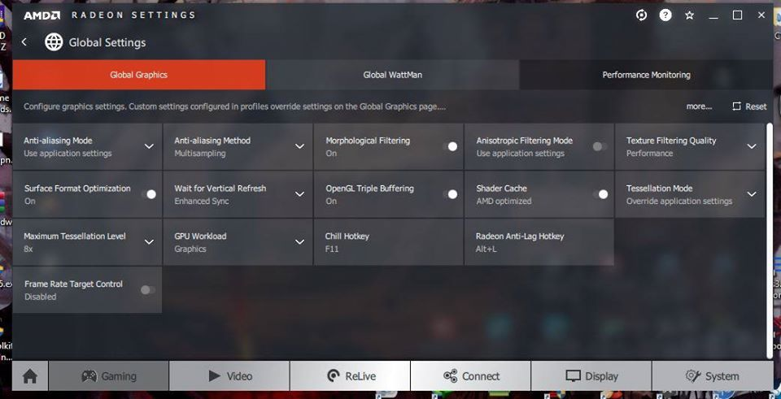

# Windows Configuration

**System Configuration**

```
  CPU       : AMD Ryzen 3 3100 4-Core Processor (8 CPUs), ~3.6GHz
  RAM       : Ripjaws V DDR4-3400MHz CL16-18-18-38 1.35V 8GB Single Stick
  SSD       : Null
  HDD       : ATA TOSHIBA DT01ACA0 500GB
  MainBoard : Gigabyte B450M DS3H V2 Rev v1.0
  GPU       : AMD RX 470 4GB 
  OS [0]    : Arch Linux x86
  OS [1]    : Windows 10 Pro 20H2 
```

**System Info**
 * Windows ~ Installed on GPT partition with UEFI. 
 * Linux ~ not installed yet 
 
**Motherboard Bios Info**
 * F1-17-8-20-FactoryBios (F1) *(old factory version)*
 * B45MDSHV.F60 (F60) **(updated and current bios)**

### Drivers 
1. AMD RX 470 - [AMD Official Site](https://www.amd.com/en/support/graphics/radeon-400-series/radeon-rx-400-series/radeon-rx-470)
2. B450 Chipset - [AMD Official Site](https://www.amd.com/en/support/chipsets/amd-socket-am4/b450)
3. Gigabyte Drivers - [www.gigabyte.com](https://www.gigabyte.com/bd/Motherboard/B450M-DS3H-V2-rev-10/support#support-dl-driver)

### GPU Settings
**Listed Stable AMD GPU Driver List** <br>
I've faced lot's of issue in amd driver's. Like blue screen, dark screen, no display, fps drop etc. So I've decided to listing a stable driver list, may it help other's to choose the best driver for their devices. 
> Currently using **Adrenalin 2020 Edition 20.4.2 (WHQL)**

| No | Driver Version | Marks                              | Basic Info                                                                      |
|----|----------------|------------------------------------|---------------------------------------------------------------------------------|
|  1 | [19.11.3]()    | :star:                             | Best of older games.                                                            |
|  2 | [20.2.2]()     | :star:                             | Old and **20.4.2** is better then that.                                         |
|  3 | [20.4.2](2)    | :star: :star: :star: :star: :star: | Best and most stable driver I've ever seen.                                     |
|  4 | [20.8.3]()     | :star: :star: :star: :star: :star: | This one is another stable driver and it's replaces **20.4.2** with latest updates. |
|  5 | [20.9.1]()     | :star:                             | **20.11.2** is better then that.                                                    |
|  6 | [20.11.2]()    | :star: :star: :star:               | Recommended and good for latest games, and slightly gave better fps.            |
|  7 | [20.12.1]()    |                                    | Not Tested Yet                                                                  |
|  8 | [21.3.1]()     |                                    | Not Tested Yet                                                                  |
|  9 | [21.4.1]()     |                                    | Not Tested Yet                                                                  |
|  10 | [21.5.2]()     |                                    | Not Tested Yet                                                                  |

### Global Settings



Farhan Sadik <br>
Square Development Group
