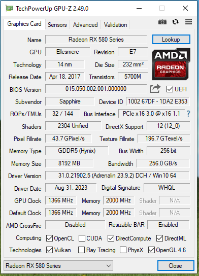
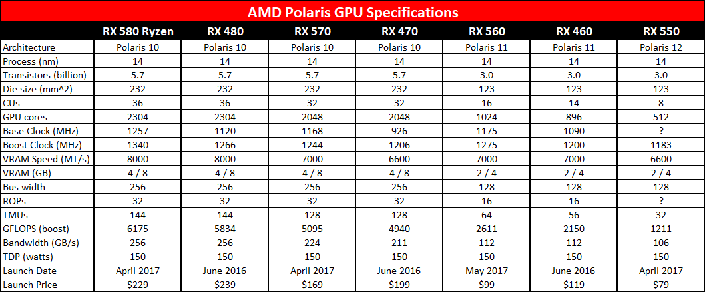

# Graphics Information
GPU-Z

### GPU Specs Comparison 

### GPU Settings

**Listed Stable AMD GPU Driver List**  
I've faced tons of issues in AMD driver. Like blue screen, dark screen, no display, fps drop, over heating etc. So I have decided to listing a stable driver list, may it help other's to choose the best driver for their devices. 

> Currently using **Adrenalin Edition 23.9.2**

### THE LIST HAS BEEN OUTDATED!

| No | Driver Version | Marks                              | Basic Info                                                                      |
|----|----------------|------------------------------------|---------------------------------------------------------------------------------|
|  1 | [19.11.3]()    | :star:                             | Best of older games.                                                            |
|  2 | [19.12.1](https://www.amd.com/en/support/kb/release-notes/rn-rad-win-19-12-1) 	  | :star: :star: :star: :star::star: | Fix for ac origins. **[Best, Stable]** |
| 3 | [20.2.2]()     | :star:                             | Old and **20.4.2** is better then that.                                         |
| 4 | [20.4.2](2)    | :star: :star: :star: :star: :star: | Best and most stable driver I've ever seen.                                     |
| 5 | [20.8.3]()     | :star: :star: :star: :star: :star: | This one is another stable driver and it's replaces **20.4.2** with latest updates. |
| 6 | [20.9.1]()     | :star:                             | **20.11.2** is better then that.                                                    |
| 7 | [20.11.2]()    | :star: :star: :star:               | Recommended and good for latest games, and slightly gave better fps.            |
| 8 | [22.3.1]()     | :star: :star: :star: :star: :star: | Currently running this version and stable for now.... using last 2-3 months     |
